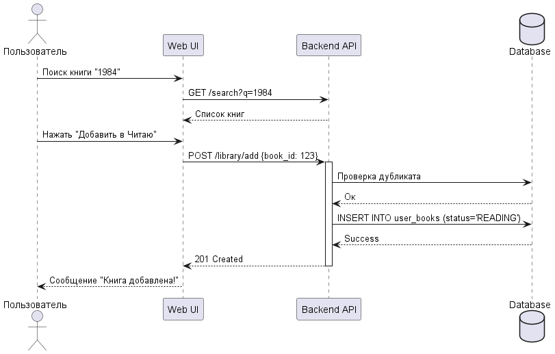
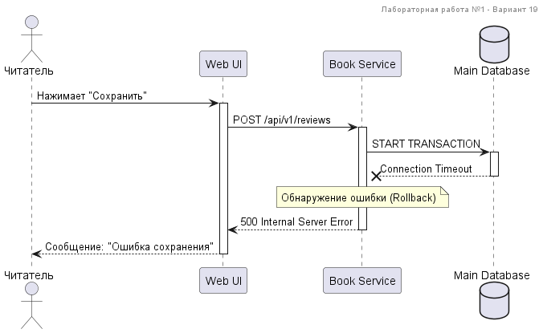

<p align="center">Министерство образования Республики Беларусь</p>
<p align="center">Учреждение образования</p>
<p align="center">"Брестский государственный технический университет"</p>
<p align="center">Кафедра ИИТ</p>

<br><br><br><br><br>

<p align="center"><strong>Лабораторная работа №1</strong></p>
<p align="center"><strong>По дисциплине:</strong> "Проектирование интернет-систем"</p>
<p align="center"><strong>Тема:</strong> "Сценарий транзакции: моделирование use-case и границ ответственности"</p>

<br><br><br><br><br>

<p align="right"><strong>Выполнил:</strong></p>
<p align="right">Студент 3 курса</p>
<p align="right">Группы ПО-13</p>
<p align="right">Потапчук А.С.</p>

<p align="right"><strong>Проверил:</strong></p>
<p align="right">Несюк А.Н.</p>

<br><br><br>

<p align="center"><strong>Брест 2026</strong></p>

---

# Цель работы

Научиться анализировать бизнес-процессы интернет-системы, выявлять границы ответственности компонентов и моделировать транзакционные сценарии с учётом возможных сбоев.

---

# Вариант №19 — Книжный трекер

**Питч:**  
Приложение для тех, кто покупает книги быстрее, чем читает.

**Ядро домена:**

- Пользователь (Читатель)
- Книга
- Отзыв
- Статус чтения
- Рейтинг

---

# Ход выполнения работы

## 1. Структура проекта
```
lab-01/
├── README.md               # Основной отчёт (этот документ)
├── use-case.md             # Текстовое описание use-case
├── diagrams/
│   ├── sequence-happy.puml # PlantUML для успешного сценария
│   ├── sequence-happy.png  # Экспорт диаграммы
│   ├── sequence-error-payment.puml
│   └── sequence-error-payment.png
├── scenarios.feature       # Gherkin-сценарии
└── analysis.md             # Анализ границ ответственности
```

---

# 2. Use-case описание

**Ссылка на файл:** [use-case.md](use-case.md)

**Основной сценарий:**  
Завершение чтения книги и добавление отзыва.

**Первичный актор:**  
Читатель.

**Цель:**  
Зафиксировать факт прочтения книги и оставить отзыв.

### Основной поток

1. Читатель открывает страницу книги.
2. Нажимает кнопку **"Завершить чтение"**.
3. Система отображает форму для ввода рейтинга и комментария.
4. Читатель вводит оценку книги и текст отзыва.
5. Система выполняет валидацию данных.
6. Система сохраняет отзыв в базе данных.
7. Система обновляет статус книги на **"прочитано"**.
8. Пересчитывается средний рейтинг книги.
9. Пользователь получает подтверждение об успешном сохранении.

### Альтернативные потоки

- Пользователь может изменить рейтинг перед отправкой.
- Пользователь может оставить отзыв без текстового комментария.

### Исключительные ситуации

- Не указан рейтинг книги.
- Ошибка соединения с базой данных.
- Книга не найдена в системе.

---

#### 3.1. Happy Path (успешный сценарий)

**PlantUML исходник:** [sequence-happy.puml](./diagrams/sequence-happy.puml)


### Описание потока

1. Пользователь отправляет запрос на завершение чтения книги.
2. Клиентское приложение отправляет данные на сервер API.
3. API проверяет корректность данных.
4. Сервер сохраняет отзыв в базе данных.
5. Обновляется статус книги.
6. Пересчитывается средний рейтинг.
7. В Event Bus публикуется событие обновления книги.
8. Пользователь получает успешный ответ.

### Участники

- Читатель
- Web Clientgit branch -M main
- API Server
- Database
- Event Bus

---

## 3.2 Error Case (сценарий с ошибкой)

**PlantUML исходник:** [sequence-error.puml](diagrams/sequence-error.puml)


### Описание потока

1. Пользователь отправляет отзыв.
2. API проверяет данные и пытается сохранить отзыв.
3. База данных возвращает ошибку соединения.
4. API выполняет откат транзакции (Rollback).
5. Пользователь получает сообщение об ошибке.

---

# 4. Gherkin-сценарии

 **Ссылка на файл:** [scenarios.feature](scenarios.feature)

**Реализовано сценариев:** 4

### Список сценариев

1.  Успешное добавление отзыва  
2.  Ошибка: не указан рейтинг  
3.  Ошибка: книга не найдена  
4.  Ошибка: сбой базы данных  

### Пример сценария

```gherkin
Feature: Добавление отзыва на книгу

Scenario: Успешное добавление отзыва
  Given пользователь авторизован
  And книга существует в системе
  When пользователь отправляет отзыв с рейтингом
  Then отзыв сохраняется в системе
  And статус книги становится "прочитано"
  ## 5. Анализ границ ответственности

 **Ссылка на файл:** [analysis.md](analysis.md)
```
---
### 5.1 Транзакционные границы

| Операция | Синхронная/Асинхронная | Откат при ошибке | Retry-стратегия | Идемпотентность |
|----------|------------------------|------------------|-----------------|-----------------|
| Сохранение отзыва | Синхронная | Да | Нет | Да |
| Изменение статуса книги | Синхронная | Да | Нет | Да |
| Пересчёт рейтинга | Синхронная | Да | Нет | Да |
| Публикация события | Асинхронная | Нет | 5 попыток | Да |

---

### 5.2 Обработка исключительных ситуаций

#### Исключительная ситуация 1: Отсутствует рейтинг

- **Условие возникновения:** пользователь отправляет отзыв без оценки.  
- **Обнаружение:** API выполняет проверку входных данных.  
- **Реакция:** сервер возвращает ошибку `400 Bad Request`.  
- **Компенсация:** изменения не выполняются.  
- **Уведомление пользователя:**  
  `"Необходимо указать рейтинг книги."`

---

#### Исключительная ситуация 2: Сбой базы данных

- **Условие возникновения:** база данных недоступна или возвращает таймаут.  
- **Обнаружение:** API получает исключение соединения.  
- **Реакция:** выполняется откат транзакции.  
- **Компенсация:** отменяются все изменения.  
- **Уведомление пользователя:**  
  `"Ошибка сохранения данных. Попробуйте позже."`

---

## Таблица критериев оценки

| Критерий | Баллы | Выполнено |
|----------|-------|-----------|
| Use-case описание | 15 | ✅ |
| Sequence diagram (happy path) | 20 | ✅ |
| Sequence diagram (error case) | 15 | ✅ |
| Gherkin-сценарии | 20 | ✅ |
| Анализ границ ответственности | 15 | ✅ |
| Обработка исключений | 10 | ✅ |
| Качество документации | 5 | ✅ |
| **ИТОГО** | **100** | |

---

## Контрольные вопросы

### 1. Что такое транзакционная граница?

Транзакционная граница — это участок системы, внутри которого несколько операций выполняются как единая транзакция. Если одна операция завершается ошибкой, все изменения откатываются.

В данном сценарии транзакционная граница проходит при сохранении отзыва и изменении статуса книги.

---

### 2. Почему операция сохранения выполняется синхронно?

Сохранение отзыва и изменение статуса книги должны происходить сразу, чтобы пользователь получил корректный результат. Поэтому операция выполняется синхронно.

---

### 3. Как обеспечить идемпотентность?

Идемпотентность обеспечивается использованием уникального идентификатора запроса и проверкой существования отзыва перед повторным сохранением.

---

### 4. Что произойдет, если внешний сервис вернет ошибку?

Если ошибка возникает после частичного выполнения операции, система выполняет откат транзакции и возвращает пользователю сообщение об ошибке.

---

### 5. Как система обнаружит недоступность сервиса?

Недоступность определяется по таймауту соединения, ошибкам сети или некорректным ответам сервиса.

---

### 6. Какие данные нужно логировать?

- идентификатор пользователя  
- идентификатор книги  
- время запроса  
- статус операции  
- текст ошибки  
- идентификатор транзакции  

---

## Ссылка на репозиторий

 **GitHub:** *(вставьте ссылку на ваш репозиторий)*

---

## Вывод

В ходе выполнения лабораторной работы был проанализирован бизнес-процесс интернет-системы **«Книжный трекер»**. Был разработан use-case сценарий завершения чтения книги и добавления отзыва. Построены диаграммы последовательности с использованием **PlantUML**, отражающие успешный сценарий и обработку ошибок. Также разработаны **Gherkin-сценарии** для описания поведения системы и выполнен анализ транзакционных границ.

В ходе работы были изучены принципы проектирования транзакционных сценариев, обработка исключений и обеспечение идемпотентности операций. Были получены навыки моделирования взаимодействия компонентов системы и анализа точек отказа в интернет-системах.

---

**Дата выполнения:** 15.03.2026  

**Оценка:** _____________  

**Подпись преподавателя:** _____________