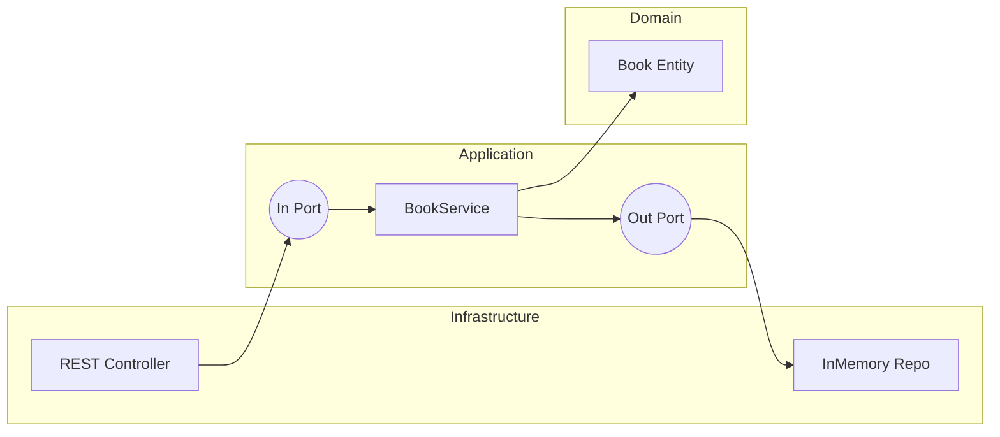

```mermaid
graph LR
    subgraph Infrastructure
        API[REST Controller]
        DB[InMemory Repo]
    end

    subgraph Application
        InPort((In Port))
        OutPort((Out Port))
        Service[BookService]
    end

    subgraph Domain
        Book[Book Entity]
    end

    API --> InPort
    InPort --> Service
    Service --> Book
    Service --> OutPort
    OutPort --> DB
```