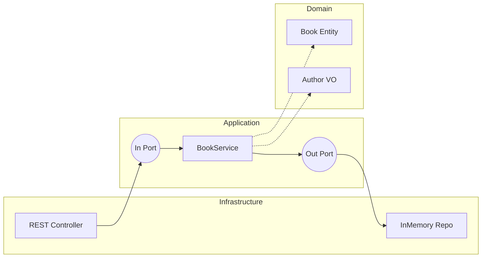
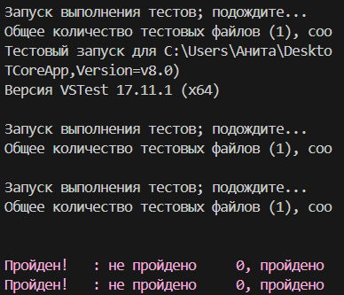

<p align="center">Министерство образования Республики Беларусь</p>
<p align="center">Учреждение образования</p>
<p align="center">"Брестский Государственный технический университет"</p>
<p align="center">Кафедра ИИТ</p>

<br><br><br><br><br><br>

<p align="center"><strong>Лабораторная работа №2</strong></p>
<p align="center"><strong>По дисциплине:</strong> "Проектирование интернет-систем"</p>
<p align="center"><strong>Тема:</strong> "Гексагональная архитектура: проектирование портов и адаптеров"</p>

<br><br><br><br><br><br>

<p align="right"><strong>Выполнил:</strong></p>
<p align="right">Студент 3 курса</p>
<p align="right">Группа ПО-13</p>
<p align="right">Потапчук А.С.</p>

<p align="right"><strong>Проверил:</strong></p>
<p align="right">Несюк А.Н.</p>

<br><br><br><br><br>

<p align="center"><strong>Брест 2026</strong></p>

---

## Цель работы

Спроектировать архитектуру сервиса с использованием гексагональной архитектуры: определить порты, адаптеры и обеспечить изоляцию доменного слоя.

---

## Вариант №19 - Книжный трекер 

**Питч:** Система для управления личной библиотекой и отслеживания прогресса чтения.  
**Ядро домена:** Book (Книга), Author (Автор - Value Object), ReadingStatus (Статус).  

**Выбранный сервис:** Book Service  

---

## Ход выполнения работы

### Часть 1. Архитектурная диаграмма

**Описание сервиса:**

Book Service управляет жизненным циклом книги:
- регистрация  
- обновление статуса  
- завершение чтения с выставлением рейтинга  



---

### Часть 2. Структура проекта

**Технология:** C# (.NET)

```
lab-02/
├── src/
│   ├── domain/
│   │   ├── models/
│   │   │   ├── Book.cs
│   │   │   └── Author.cs
│   │   └── exceptions/
│   ├── application/
│   │   ├── port/
│   │   │   ├── in/
│   │   │   │   └── IFinishBookUseCase.cs
│   │   │   └── out/
│   │   │       └── IBookRepository.cs
│   │   └── service/
│   │       └── BookService.cs
│   └── infrastructure/
│       └── adapter/
│           └── out/
│               └── InMemoryBookRepository.cs
├── lab-02.Tests/
│   └── BookServiceTests.cs
└── Report.md
```

---

### Часть 3. Domain Layer

#### Value Object: Author

```csharp
public record Author(string FirstName, string LastName);
```

#### Entity: Book

```csharp
public class Book {
    public Guid Id { get; private set; }
    public string Title { get; private set; }
    public Author Author { get; private set; }
    public string Status { get; private set; }
    public int? Rating { get; private set; }

    public Book(string title, Author author) {
        Id = Guid.NewGuid();
        Title = title;
        Author = author;
        Status = "InProgress";
    }

    public void CompleteReading(int rating) {
        if (rating < 1 || rating > 5)
            throw new ArgumentException("Рейтинг должен быть от 1 до 5");

        Rating = rating;
        Status = "Completed";
    }
}
```

#### Бизнес-правила

- Рейтинг должен быть от 1 до 5  
- Книга не может быть завершена без рейтинга  
- Author является неизменяемым объектом  

---

### Часть 4. Application Layer

#### Входящий порт

```csharp
public interface IFinishBookUseCase {
    void Execute(Guid bookId, int rating);
}
```

#### Исходящий порт

```csharp
public interface IBookRepository {
    Book GetById(Guid id);
    void Save(Book book);
}
```

#### Application Service

```csharp
public class BookService : IFinishBookUseCase {
    private readonly IBookRepository repository;

    public BookService(IBookRepository repository) {
        this.repository = repository;
    }

    public void Execute(Guid bookId, int rating) {
        var book = repository.GetById(bookId);
        book.CompleteReading(rating);
        repository.Save(book);
    }
}
```

---

### Часть 5. Infrastructure Layer

```csharp
public class InMemoryBookRepository : IBookRepository {
    private readonly Dictionary<Guid, Book> storage = new();

    public Book GetById(Guid id) => storage[id];

    public void Save(Book book) {
        storage[book.Id] = book;
    }
}
```

---

### Часть 6. Dependency Injection

```csharp
var services = new ServiceCollection();

services.AddSingleton<IBookRepository, InMemoryBookRepository>();
services.AddTransient<IFinishBookUseCase, BookService>();

var provider = services.BuildServiceProvider();
```

**Описание:**

Зависимости внедряются через контейнер.  
BookService получает IBookRepository через конструктор.

---

### Часть 7. Тестирование

```csharp
using Xunit;

public class BookServiceTests {

    [Fact]
    public void ShouldCompleteBookReading() {
        var repo = new InMemoryBookRepository();
        var service = new BookService(repo);

        var book = new Book("Чистый код", new Author("Роберт", "Мартин"));
        repo.Save(book);

        service.Execute(book.Id, 5);

        Assert.Equal("Completed", book.Status);
        Assert.Equal(5, book.Rating);
    }
}
```

**Что тестируется:**
- Завершение книги  
- Установка рейтинга  
- Изменение статуса  

---

## Критерии выполнения

| Критерий | Выполнено | Комментарий |
|----------|----------|------------|
| Структура проекта | ✅ | Разделение слоёв |
| Domain Layer | ✅ | Entity + Value Object |
| Порты | ✅ | In/Out |
| Адаптеры | ✅ | Repository |
| DI | ✅ | ServiceCollection |
| Тесты | ✅ | xUnit |
| Документация | ✅ | Полная |

**Итого: 7 / 7**

---

## 6. Выводы

### Что получилось хорошо

Удалось реализовать гексагональную архитектуру с чётким разделением слоёв:
- Domain слой (Book, Author) полностью независим от инфраструктуры  
- Application слой (BookService) управляет бизнес-логикой через порты  
- Infrastructure слой реализует детали хранения данных  

Сервис легко тестируется благодаря использованию интерфейсов и внедрению зависимостей (DI).

---

### С какими трудностями столкнулись

Возникли сложности с:
- пониманием принципа работы портов и адаптеров  
- необходимостью создания интерфейсов даже при одной реализации  
- настройкой Dependency Injection  
- написанием и запуском юнит-тестов  
- синтаксисом Mermaid при построении диаграммы  

После изучения принципа Dependency Inversion стало понятно, что интерфейсы необходимы для тестируемости и возможности замены реализации (например, InMemory → база данных).

---

### Что узнали нового

В ходе работы были изучены следующие концепции:
- Гексагональная архитектура (Hexagonal Architecture)  
- Паттерн Ports & Adapters  
- Принцип инверсии зависимостей (DIP)  
- Dependency Injection (DI)  
- Основы модульного тестирования (unit testing) в .NET  

Стало понятно, как изолировать бизнес-логику от внешних зависимостей и упростить тестирование системы.

---

### Как можно улучшить

- Добавить REST API контроллер  
- Подключить реальную базу данных (например, PostgreSQL)  
- Реализовать дополнительные use-case’ы  
- Добавить больше юнит-тестов  

---

## 7. Приложения

### Ссылка на репозиторий

https://github.com/kwappeta/pis-labs

**Прохождение тестов**:


---
**Дата сдачи:** ___18.03.2026___  
**Подпись:** Потапчук А.С.